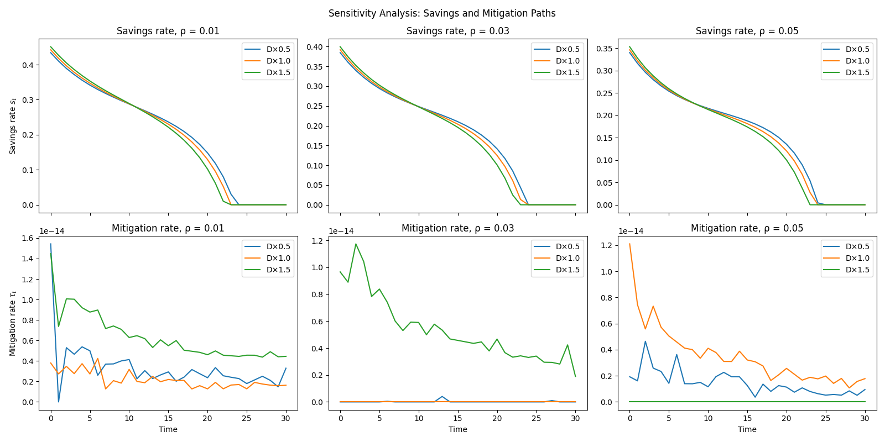

# Simple Integrated Assessment Model (IAM) with Climate-Economy Tradeoffs

This repository provides a simple Integrated Assessment Model (IAM) implemented in Python using the SciPy optimization library.
It is based on a Solow-style growth model under climate constraints and solves for the optimal savings and mitigation paths.

## Features

- Solves an IAM using `scipy.optimize.minimize`
- Includes:
  - Capital dynamics
  - Climate damage and mitigation
  - Utility maximization
- Plots optimal policy trajectories
- Runs sensitivity analysis

## Directory Structure

- `notebooks/`: Jupyter Notebook with full implementation
- `imgs/`: Output images

## Getting Started

```bash
git clone https://github.com/Mitsuhiro-ODAKA/simple-iam.git
cd simple-iam
pip install -r requirements.txt
jupyter notebook notebooks/simple_iam.ipynb
```


